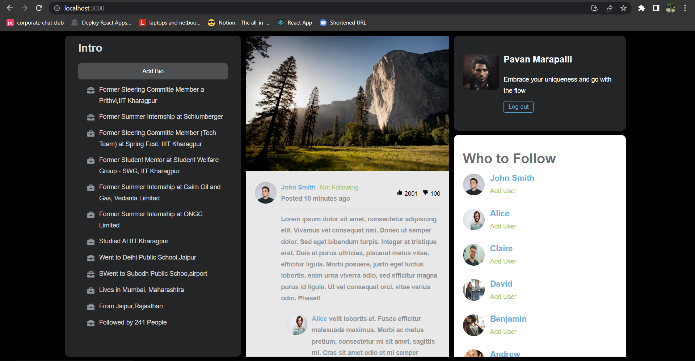
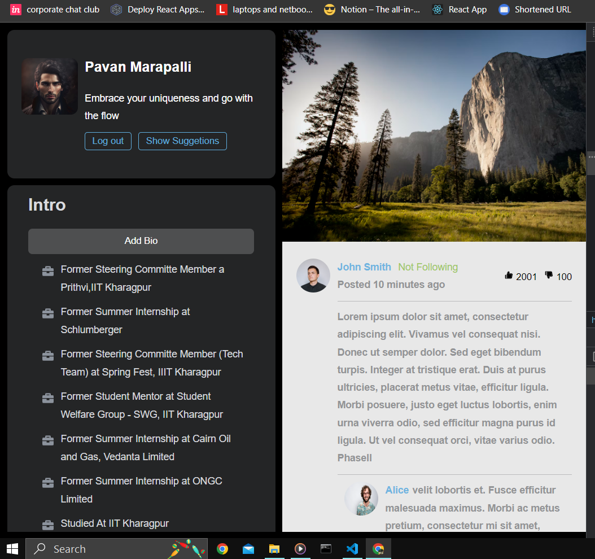
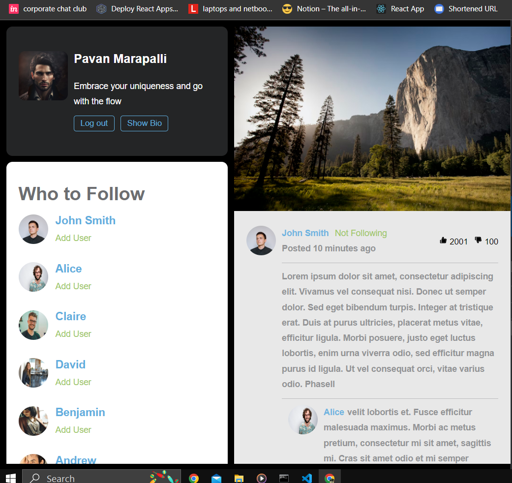
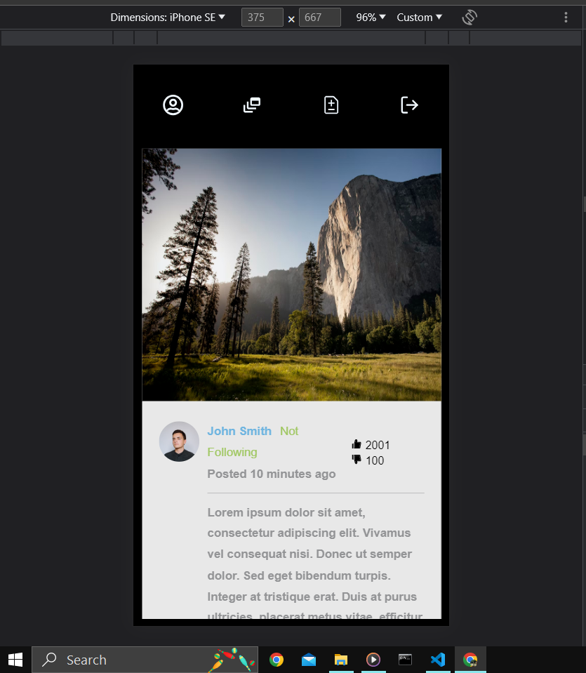
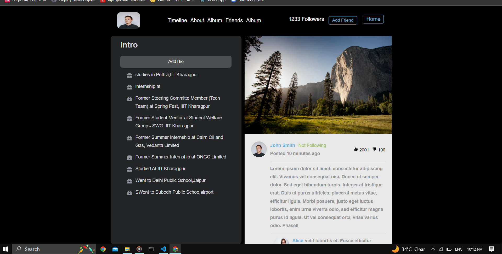
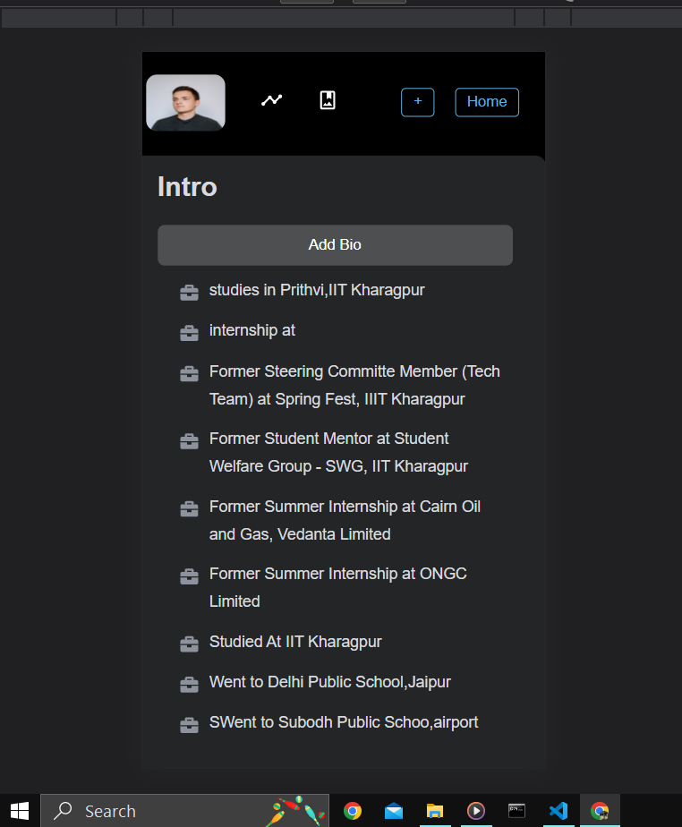

This is a sample README file of this applicaton to provide an overview to run application

Here are some images of the application :

          

# Dependencies setup.

- To install the dependencies in a React JS project, you can use the npm package manager. Open your project's terminal or command prompt and navigate to the project directory. Then run the following command:

        - npm install react@18.2.0 react-dom@18.2.0
        - npm install react-icons@4.9.0
        - npm install react-router-dom@4.2.2

  once all the dependencies installed run **npm start** to start the server

# Explore the application Have fun :)

- At any point of time if you have any issues feel free to ping me
  - pavanmarapalli171862@gmail.com
